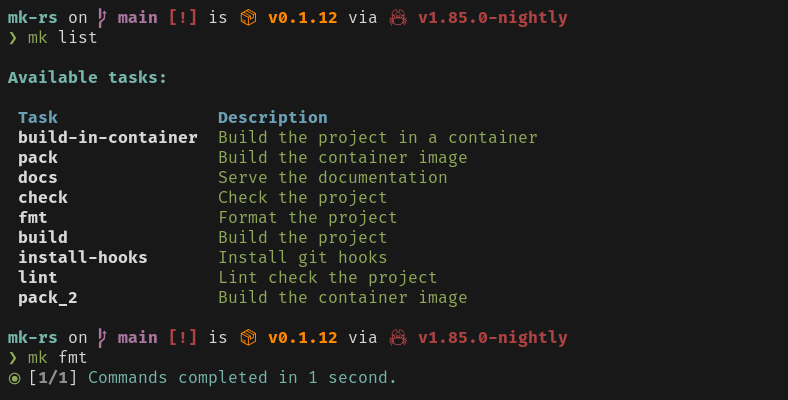

# mk (Make)

[](https://crates.io/crates/mk)
[](https://crates.io/crates/mk)
[](https://github.com/ffimnsr/mk-rs/blob/master/LICENSE-APACHE)
[](https://github.com/ffimnsr/mk-rs/blob/master/.github/workflows/ci.yml)


> Efficiency is doing things right; effectiveness is doing the right things. This tool helps you do both.
> One task runner to rule them all.


Yet another simple task runner.

`mk` is a powerful and flexible task runner designed to help you automate and manage your tasks efficiently. It supports running commands both locally and inside containers, making it versatile for various environments and use cases. Running tasks in containers is a first-class citizen, ensuring seamless integration with containerized workflows.



## Features

- **Simple Configuration**: Define your tasks in a straightforward YAML file.
- **Flexible Execution**: Run tasks locally, in containers, or as nested tasks.
- **Error Handling**: Control how errors are handled with `ignore_errors`.
- **Verbose Output**: Enable verbose output for detailed logs.

## Installation

Binary for different OS distribution can be downloaded [here](https://github.com/ffimnsr/mk-rs/releases). Linux, macOS, and Windows are supported.

### Install using script

`mk` runs on most major platforms. If your platform isn't listed below, please [open an issue](https://github.com/ffimnsr/mk-rs/issues/new).

<details>
  <summary>Linux / WSL / MSYS2 / Cygwin / Git Bash</summary>

  > The recommended way to install mk is via the install script:
  >
  >
  > ```sh
  > curl -sSfL https://raw.githubusercontent.com/ffimnsr/mk-rs/main/install.sh | sh
  > ```
</details>

<details>
  <summary>BSD / Android</summary>

  > The recommended way to install mk is via the install script:
  >
  >
  > ```sh
  > curl -sS https://raw.githubusercontent.com/ffimnsr/mk-rs/main/install.sh | bash
  > ```
</details>

### From source

If you're into **Rust**, then `mk` can be installed with `cargo`. The minimum supported version of Rust is `1.37.0`. The binaries produce may be bigger than expected as it contains debug symbols.

```bash
cargo install --locked mk
```

### Manual installation

Follow the instruction below to install and use `mk` on your system.

1. Download the binary for your OS distribution [here](https://github.com/ffimnsr/mk-rs/releases).
2. Copy it to your system binary directory (`/usr/local/bin`) or to your userspace binary directory (`$HOME/.local/bin`).


## Usage

### Using CLI

```bash
Yet another simple task runner 🦀

Usage: mk [OPTIONS] [TASK_NAME] [COMMAND]

Commands:
  run          Run specific tasks
  list         List all available tasks
  completions  Generate shell completions
  help         Print this message or the help of the given subcommand(s)

Arguments:
  [TASK_NAME]  The task name to run

Options:
  -c, --config <CONFIG>  Config file to source [default: tasks.yaml]
  -h, --help             Print help
  -V, --version          Print version
```

Here is a sample command line usage of `mk`.

```bash
mk -c tasks.yaml <task_name>

...or...

mk run <task_name>
```

Both commands above are equivalent. The config file can be omitted as `mk` defaults to file `tasks.yaml`.

### Makefile and task.yaml comparison

Below is the Makefile:

```makefile
cov := "--cov=test --cov-branch --cov-report=term-missing"

all:
    @just --list

install:
    pip install -r requirements/dev.txt -r requirements/test.txt -e .

clean: clean-build clean-pyc

clean-build:
    rm -rf build dist test.egg-info

clean-pyc:
    find . -type f -name *.pyc -delete

lint:
    ruff check test --line-length 100

build: lint clean
    python setup.py sdist bdist_wheel

release: build && tag
    twine upload dist/*

tag:
    #!/usr/bin/env zsh
    tag=$(python -c 'import test; print("v" + test.__version__)')
    git tag -a $tag -m "Details: https://github.com/sample/sample.git"
    git push origin $tag

test:
    pytest {{ cov }}

ptw:
    ptw -- {{ cov }}

cov-report:
    coverage report -m
```

And here's the rewritten tasks.yaml file, converted from the original Makefile above:

```yaml
tasks:
  install: pip install -r requirements/dev.txt -r requirements/test.txt -e .
  clean:
    commands:
      - task: clean-build
      - task: clean-pyc
  clean-build: |
    rm -rf build dist test.egg-info
  clean-pyc: find . -type f -name *.pyc -delete
  lint: ruff check test --line-length 100
  build:
    depends_on:
      - lint
      - clean
    commands:
      - python setup.py sdist bdist_wheel
  release:
    depends_on:
      - build
      - tag
    commands:
      - twine upload dist/*
  tag:
    commands:
      - command: |
          tag=$(python -c 'import test; print("v" + test.__version__)')
          git tag -a $tag -m "Details: https://github.com/sample/sample.git"
          git push origin $tag
        shell: zsh
  test: pytest --cov=test --cov-branch --cov-report=term-missing
  ptw: ptw -- --cov=test --cov-branch --cov-report=term-missing
  cov-report: coverage html
```

By transforming our 40-line Makefile into a streamlined 30-line tasks.yaml file, we can achieve a cleaner and more efficient setup.
This new format is not only more editor-friendly but also supports code folding for better readability.

As you can see, most of the fields are optional and can be omitted. You only need to modify them when deeper configuration is required.

### Sample real-world task yaml

Let's create a sample yaml file called `tasks.yaml`.

```yaml
tasks:
  task1:
    commands:
      - command: |
          echo $FOO
          echo $BAR
        shell: bash
        ignore_errors: false
        verbose: true
      - command: 'true'
        shell: zsh
        ignore_errors: true
        verbose: true
      - command: echo $BAR
        ignore_errors: false
        verbose: true
    depends_on:
      - name: task1
    description: This is a task
    labels: {}
    environment:
      FOO: bar
    env_file:
      - test.env
```

Here's the `test.env` that needed by the yaml file:

```dotenv
BAR=foo
```

This yaml task named `task1` can be run on `mk` with the command below:


```bash
mk task1
```

Here's a longer version Yaml that utilize container run on `task5`:

```yaml
tasks:
  task1:
    depends_on:
      - name: task4
    preconditions:
      - command: echo "Precondition 1"
      - command: echo "Precondition 2"
    commands:
      - command: |
          echo $FOO
          echo $BAR
        verbose: true
      - command: echo fubar
        verbose: true
      - command: echo $BAR
        verbose: true
      - task: task3
    description: This is a task
    labels:
      - label=1
      - label=2
    environment:
      FOO: bar
    env_file:
      - test.env
  task2:
    commands:
      - command: echo $FOO
        verbose: true
    depends_on:
      - name: task1
    description: This is a task
    labels: {}
    environment:
      FOO: bar
    env_file:
      - test.env
  task3:
    commands:
      - command: echo $FOO
        verbose: true
    description: This is a task
    labels: {}
    environment:
      FOO: bar
    env_file:
      - test.env
  task4:
    commands:
      - command: echo $FOO
        verbose: true
    description: This is a task
    labels: {}
    environment:
      FOO: fubar
    env_file:
      - test.env
  task5:
    commands:
      - container_command:
          - bash
          - -c
          - echo $FOO
        image: docker.io/library/bash:latest
        verbose: true
    description: This is a task
    labels: {}
    environment:
      FOO: fubar
    env_file:
      - test.env
```

#### Support for anchors and aliases

The tasks.yaml file currently supports YAML anchors and aliases, allowing you to avoid repetition.
Here's a sample configuration:

```yaml
x-sample: &task-precondition
  preconditions:
    - command: echo "Precondition 1"
    - command: echo "Precondition 2"

tasks:
  task_a:
    <<: *task-precondition
    commands:
      - command: echo "I'm on macOS"
        test: test $(uname) = 'Darwin'
      - command: echo "I'm on Linux"
        test: test $(uname) = 'Linux'
```

#### Handling Cyclic Dependencies

Cyclic dependencies occur when a task depends on itself, either directly or indirectly, creating a loop that can cause the system to run indefinitely. To prevent this, the system detects cyclic dependencies and exits immediately with an error message.

##### Example of Cyclic Dependency

Consider the following tasks:

```yaml
tasks:
  task_a:
    depends_on:
      - task_b
    commands:
      - command: "echo 'Running task A'"
        shell: "sh"
        ignore_errors: false
        verbose: true
  task_b:
    depends_on:
      - task_c
    commands:
      - command: "echo 'Running task B'"
        shell: "sh"
        ignore_errors: false
        verbose: true
  task_c:
    depends_on:
      - task_a
    commands:
      - command: "echo 'Running task C'"
        shell: "sh"
        ignore_errors: false
        verbose: true
```

In this example, task_a depends on task_b, task_b depends on task_c, and task_c depends on task_a, creating a cyclic dependency.

#### How the System Handles Cyclic Dependencies

When the system detects a cyclic dependency, it exits immediately with an error message indicating the cycle. This prevents the system from entering an infinite loop.

## Config Schema

The docs can be found [here](https://me.vastorigins.com/mk-rs/#/schema).

## What's on the roadmap?

- [ ] Add lua script as config file
- [ ] Add support for saving and reusing command output (output can be reused on other command inside a task)
- [ ] Add secrets env storage that use GPG storage
- [ ] Add proper documentation
- [ ] Add support for cargo env
- [ ] Add support for trigger reload when on cargo run
- [ ] Add fuzzy finder for tasks
- [ ] Add unit tests and benchmarks
- [ ] Add support for npm scripts
- [ ] Add fuzzer scripts for code fuzzing
- [ ] Import and include yaml from local (relative paths, and absolute) and remote sources
- [ ] Make sure to support windows and macOS
- [ ] Make use of labels
- [ ] Proper prop argument drilling so ignore_errors on defined on task would go down properly on child commands
- [ ] Support for lima and nerdctrl
- [ ] There's still a lot of unknown, if you found a bug please report.

## License

Licensed under either of

- Apache License, Version 2.0 ([LICENSE-APACHE](LICENSE-APACHE) or
  http://www.apache.org/licenses/LICENSE-2.0)
- MIT license ([LICENSE-MIT](LICENSE-MIT) or http://opensource.org/licenses/MIT)

at your option.

### Contribution

Unless you explicitly state otherwise, any contribution intentionally submitted for inclusion in the work by you, as defined in the Apache-2.0 license, shall be dual licensed as above, without any additional terms or conditions.

## References

- https://taskfile.dev/ - Taskfile
- https://compose-spec.github.io/compose-spec/ - Docker Compose
- https://docs.ansible.com/ansible/latest/playbook_guide/playbooks_intro.html - Ansible
