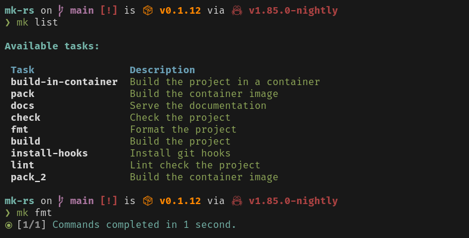

# mk (Make)

[](https://crates.io/crates/mk)
[](https://crates.io/crates/mk)
[](https://github.com/ffimnsr/mk-rs/blob/master/LICENSE-APACHE)
[](https://github.com/ffimnsr/mk-rs/blob/master/.github/workflows/ci.yml)

> Efficiency is doing things right; effectiveness is doing the right things. This tool helps you do both.
> One task runner to rule them all.


Yet another simple task runner.

`mk` is a powerful and flexible task runner designed to help you automate and manage your tasks efficiently. It supports running commands both locally and inside containers, making it versatile for various environments and use cases. Running tasks in containers is a first-class citizen, ensuring seamless integration with containerized workflows.



## Features

- **Simple Configuration**: Define your tasks in a straightforward YAML file.
- **Flexible Execution**: Run tasks locally, in containers, or as nested tasks.
- **Error Handling**: Control how errors are handled with `ignore_errors`.
- **Verbose Output**: Enable verbose output for detailed logs.

## Configuration format support

Other supported file type configurations format:

- JSON
- TOML
- Lua

See example folder for sample configuration file.

## Installation

Binary for different OS distribution can be downloaded [here](https://github.com/ffimnsr/mk-rs/releases). Linux, macOS, and Windows are supported.

### Install using script

`mk` runs on most major platforms. If your platform isn't listed below, please [open an issue](https://github.com/ffimnsr/mk-rs/issues/new).

<details>
  <summary>Linux / WSL / MSYS2 / Cygwin / Git Bash</summary>

  > The recommended way to install mk is via the install script:
  >
  >
  > ```sh
  > curl -sSfL https://raw.githubusercontent.com/ffimnsr/mk-rs/main/install.sh | sh
  > ```
</details>

<details>
  <summary>BSD / Android</summary>

  > The recommended way to install mk is via the install script:
  >
  >
  > ```sh
  > curl -sS https://raw.githubusercontent.com/ffimnsr/mk-rs/main/install.sh | bash
  > ```
</details>

### From source

If you're into **Rust**, then `mk` can be installed with `cargo`. The minimum supported version of Rust is `1.37.0`. The binaries produce may be bigger than expected as it contains debug symbols.

```bash
cargo install --locked mk
```

### Manual installation

Follow the instruction below to install and use `mk` on your system.

1. Download the binary for your OS distribution [here](https://github.com/ffimnsr/mk-rs/releases).
2. Copy it to your system binary directory (`/usr/local/bin`) or to your userspace binary directory (`$HOME/.local/bin`).


## Usage

### Using CLI

```bash
Yet another simple task runner 🦀

Usage: mk [OPTIONS] [TASK_NAME] [COMMAND]

Commands:
  init        Initialize a sample tasks.yaml file in the current directory
  run         Run specific tasks [aliases: r]
  list        List all available tasks [aliases: ls]
  completion  Generate shell completions [aliases: comp, completions]
  validate    Validate task configuration without executing tasks
  plan        Show the resolved execution plan for a task
  secrets     Access stored secrets [aliases: s]
  update      Check for mk (make) updates
  clean-cache Remove mk task cache metadata
  schema      Print the JSON Schema for the task configuration file
  help        Print this message or the help of the given subcommand(s)

Arguments:
  [TASK_NAME]  The task name to run

Options:
  -c, --config <CONFIG>  Config file to source [env: MK_CONFIG=] [default: tasks.yaml]
  -h, --help             Print help (see more with '--help')
  -V, --version          Print version
```

Here is a sample command line usage of `mk`.

```bash
mk -c tasks.yaml <task_name>

...or...

mk run <task_name>
```

Both commands above are equivalent. The config file can be omitted as `mk` defaults to file `tasks.yaml`.
When `tasks.yaml` is missing, `mk` also checks `tasks.yml`, `.mk/tasks.yaml`, `.mk/tasks.yml`, `mk.toml`, `tasks.toml`, `tasks.json`, `tasks.lua`, `.mk/tasks.toml`, `.mk/tasks.json`, and `.mk/tasks.lua`.
`mk init` writes YAML sample configs only. Use `.yaml` or `.yml` output paths.

Recent workflow features:

- `mk validate` validates task graphs and command configuration without running anything.
- `mk plan <task>` and `mk run <task> --dry-run` show the resolved execution plan.
- `mk run <task> --json-events` emits newline-delimited JSON task and command events.
- Tasks can opt into incremental caching with `inputs`, `outputs`, and `cache.enabled`.
- Cached tasks that depend on other tasks should declare dependency-produced files in `inputs` so cache invalidation sees dependency side effects.
- Container commands can select `runtime: docker|podman|auto`.
- Local `command:` steps can save stdout with `save_output_as` and reuse it later via `${{ outputs.NAME }}`.

### Cache semantics

Cache hit only skips task command execution.

- Dependencies still run before cache evaluation.
- Preconditions still run before cache evaluation.
- Cache validity only sees declared task state: task definition, environment, env files, secrets paths, declared `inputs`, and declared `outputs`.
- Cache validity does not infer hidden side effects from `depends_on`. If dependency output matters, declare that file in `inputs`.
- If `cache.enabled` is set with `depends_on` but no `inputs`, `mk validate` warns because stale cache hits are easy to create.

Current limitation: `mk init` writes YAML templates only. If TOML/JSON/Lua remain first-class config entrypoints, format-specific `mk init` templates should be added later instead of relying on manual conversion.

### Task labels

Tasks can carry arbitrary key-value labels in the `labels` map. Labels are task metadata used for filtering; they do not affect execution order or environment.

```yaml
tasks:
  test-unit:
    labels:
      area: ci
      kind: test
    commands:
      - command: cargo test

  test-integration:
    labels:
      area: ci
      kind: integration
    commands:
      - command: cargo test --test '*'

  build-release:
    labels:
      area: ci
      kind: build
    commands:
      - command: cargo build --release
```

Filter the task list by label:

```bash
# show all tasks tagged area=ci
mk list --label area=ci

# show only integration tasks
mk list --label kind=integration

# AND filters: show tasks matching both area=ci and kind=test
mk list --label area=ci --label kind=test
```

Run all tasks matching a label filter:

```bash
# run every task with kind=test
mk run --label kind=test

# run tasks that match area=ci AND kind=build
mk run --label area=ci --label kind=build
```

Show execution plans for matching tasks:

```bash
mk plan --label area=ci
mk plan --label area=ci --json
```

Notes:

- Multiple `--label` flags are combined as AND; all filters must match for a task to be selected.
- `mk run --label` runs all matching tasks in deterministic sorted order.
- Task `labels` are distinct from `container_build.labels`, which are OCI image labels applied during a container build.
- Label keys starting with `mk.` are reserved; `mk validate` warns if they are used.
- `mk validate` also warns on empty label keys or empty label values.

### Shell completion install examples

Dynamic task-name completion is not implemented yet. Static shell completion for subcommands and flags is available now.

```bash
# Bash: generate completion and load it from ~/.bashrc
mkdir -p ~/.local/share/bash-completion/completions
mk completion bash > ~/.local/share/bash-completion/completions/mk
grep -qxF '[[ -r ~/.local/share/bash-completion/completions/mk ]] && source ~/.local/share/bash-completion/completions/mk' ~/.bashrc || \
  echo '[[ -r ~/.local/share/bash-completion/completions/mk ]] && source ~/.local/share/bash-completion/completions/mk' >> ~/.bashrc

# Zsh: generate completion and load it from ~/.zshrc
mkdir -p ~/.zfunc
mk completion zsh > ~/.zfunc/_mk
grep -qxF 'fpath=(~/.zfunc $fpath)' ~/.zshrc || echo 'fpath=(~/.zfunc $fpath)' >> ~/.zshrc
grep -qxF 'autoload -Uz compinit && compinit' ~/.zshrc || echo 'autoload -Uz compinit && compinit' >> ~/.zshrc

# Fish: generate completion and Fish will load it automatically
mkdir -p ~/.config/fish/completions
mk completion fish > ~/.config/fish/completions/mk.fish

# PowerShell: generate completion and load it from $PROFILE
mkdir -p "$(dirname \"$PROFILE\")"
mk completion powershell > "$HOME/mk-completion.ps1"
if (-not (Select-String -Path $PROFILE -SimpleMatch '. "$HOME/mk-completion.ps1"' -Quiet)) {
  Add-Content -Path $PROFILE -Value '. "$HOME/mk-completion.ps1"'
}
```

Open new shell after writing startup-file changes, or source profile manually:

```bash
source ~/.bashrc
source ~/.zshrc
```

```fish
source ~/.config/fish/config.fish
```

```powershell
. $PROFILE
```

### Makefile and task.yaml comparison

Below is the Makefile:

```makefile
cov := "--cov=test --cov-branch --cov-report=term-missing"

all:
    @just --list

install:
    pip install -r requirements/dev.txt -r requirements/test.txt -e .

clean: clean-build clean-pyc

clean-build:
    rm -rf build dist test.egg-info

clean-pyc:
    find . -type f -name *.pyc -delete

lint:
    ruff check test --line-length 100

build: lint clean
    python setup.py sdist bdist_wheel

release: build && tag
    twine upload dist/*

tag:
    #!/usr/bin/env zsh
    tag=$(python -c 'import test; print("v" + test.__version__)')
    git tag -a $tag -m "Details: https://github.com/sample/sample.git"
    git push origin $tag

test:
    pytest {{ cov }}

ptw:
    ptw -- {{ cov }}

cov-report:
    coverage report -m
```

And here's the rewritten tasks.yaml file, converted from the original Makefile above:

```yaml
tasks:
  install: pip install -r requirements/dev.txt -r requirements/test.txt -e .
  clean:
    commands:
      - task: clean-build
      - task: clean-pyc
  clean-build: |
    rm -rf build dist test.egg-info
  clean-pyc: find . -type f -name *.pyc -delete
  lint: ruff check test --line-length 100
  build:
    depends_on:
      - lint
      - clean
    commands:
      - python setup.py sdist bdist_wheel
  release:
    depends_on:
      - build
      - tag
    commands:
      - twine upload dist/*
  tag:
    commands:
      - command: |
          tag=$(python -c 'import test; print("v" + test.__version__)')
          git tag -a $tag -m "Details: https://github.com/sample/sample.git"
          git push origin $tag
        shell: zsh
  test: pytest --cov=test --cov-branch --cov-report=term-missing
  ptw: ptw -- --cov=test --cov-branch --cov-report=term-missing
  cov-report: coverage html
```

By transforming our 40-line Makefile into a streamlined 30-line tasks.yaml file, we can achieve a cleaner and more efficient setup.
This new format is not only more editor-friendly but also supports code folding for better readability.

As you can see, most of the fields are optional and can be omitted. You only need to modify them when deeper configuration is required.

### Sample real-world task yaml

Let's create a sample yaml file called `tasks.yaml`.

```yaml
tasks:
  task1:
    commands:
      - command: |
          echo $FOO
          echo $BAR
        shell: bash
        ignore_errors: false
        verbose: true
      - command: 'true'
        shell: zsh
        ignore_errors: true
        verbose: true
      - command: echo $BAR
        ignore_errors: false
        verbose: true
    depends_on:
      - name: task1
    description: This is a task
    labels: {}
    environment:
      FOO: bar
    env_file:
      - test.env
```

Here's the `test.env` that needed by the yaml file:

```dotenv
BAR=foo
```

This yaml task named `task1` can be run on `mk` with the command below:


```bash
mk task1
```

Here's a longer version Yaml that utilize container run on `task5`:

```yaml
tasks:
  task1:
    depends_on:
      - name: task4
    preconditions:
      - command: echo "Precondition 1"
      - command: echo "Precondition 2"
    commands:
      - command: |
          echo $FOO
          echo $BAR
        verbose: true
      - command: echo fubar
        verbose: true
      - command: echo $BAR
        verbose: true
      - task: task3
    description: This is a task
    labels:
      - label=1
      - label=2
    environment:
      FOO: bar
    env_file:
      - test.env
  task2:
    commands:
      - command: echo $FOO
        verbose: true
    depends_on:
      - name: task1
    description: This is a task
    labels: {}
    environment:
      FOO: bar
    env_file:
      - test.env
  task3:
    commands:
      - command: echo $FOO
        verbose: true
    description: This is a task
    labels: {}
    environment:
      FOO: bar
    env_file:
      - test.env
  task4:
    commands:
      - command: echo $FOO
        verbose: true
    description: This is a task
    labels: {}
    environment:
      FOO: fubar
    env_file:
      - test.env
  task5:
    commands:
      - container_command:
          - bash
          - -c
          - echo $FOO
        image: docker.io/library/bash:latest
        verbose: true
    description: This is a task
    labels: {}
    environment:
      FOO: fubar
    env_file:
      - test.env
```

#### Support for anchors and aliases

The tasks.yaml file currently supports YAML anchors and aliases, allowing you to avoid repetition.
Here's a sample configuration:

```yaml
x-sample: &task-precondition
  preconditions:
    - command: echo "Precondition 1"
    - command: echo "Precondition 2"

tasks:
  task_a:
    <<: *task-precondition
    commands:
      - command: echo "I'm on macOS"
        test: test $(uname) = 'Darwin'
      - command: echo "I'm on Linux"
        test: test $(uname) = 'Linux'
```

#### Handling Cyclic Dependencies

Cyclic dependencies occur when a task depends on itself, either directly or indirectly, creating a loop that can cause the system to run indefinitely. To prevent this, the system detects cyclic dependencies and exits immediately with an error message.

##### Example of Cyclic Dependency

Consider the following tasks:

```yaml
tasks:
  task_a:
    depends_on:
      - task_b
    commands:
      - command: "echo 'Running task A'"
        shell: "sh"
        ignore_errors: false
        verbose: true
  task_b:
    depends_on:
      - task_c
    commands:
      - command: "echo 'Running task B'"
        shell: "sh"
        ignore_errors: false
        verbose: true
  task_c:
    depends_on:
      - task_a
    commands:
      - command: "echo 'Running task C'"
        shell: "sh"
        ignore_errors: false
        verbose: true
```

In this example, task_a depends on task_b, task_b depends on task_c, and task_c depends on task_a, creating a cyclic dependency.

#### How the System Handles Cyclic Dependencies

When the system detects a cyclic dependency, it exits immediately with an error message indicating the cycle. This prevents the system from entering an infinite loop.

## Secret Vault

To generate secrets, first create a private key:

```bash
mk secrets key gen
```

The key will be saved in the default directory `~/.config/mk/priv`. This can be changed if needed.

Next, initialize a secret vault:

```bash
mk secrets vault init
```

To store secrets (for example, saving a dotenv file in the vault):

```bash
cat .env | mk secrets vault set app/development/jobserver
```

To display secrets:

```bash
mk secrets vault show app/development/jobserver
```

To list available secrets:

```bash
mk secrets vault list
```

To export secrets back to a dotenv file:

```bash
mk secrets vault export --output .env app/development/jobserver

...or...

mk secrets vault export app/development/jobserver > .env
```

Secrets can also be consumed directly from `tasks.yaml`.

Use `secrets.secrets_path` when the decrypted secret is dotenv content:

```yaml
secrets:
  vault_location: ./.mk/vault
  keys_location: ./.mk/keys
  key_name: default

tasks:
  deploy:
    secrets:
      secrets_path:
        - app/development/env
    commands:
      - command: env | grep '^NODE_ENV='
```

Root-level `secrets:` applies to all tasks. A per-task `secrets:` block overrides individual fields for that task only:

```yaml
secrets:
  vault_location: ./.mk/vault
  keys_location: ~/.config/mk/priv
  key_name: default

tasks:
  deploy:
    # inherits root secrets settings
    secrets:
      secrets_path:
        - app/production/env
    commands:
      - command: ./deploy.sh
  dev:
    # overrides key_name for this task only
    secrets:
      key_name: dev-key
      secrets_path:
        - app/development/env
    commands:
      - command: ./dev-start.sh
```

If `app/development/env` decrypts to:

```dotenv
NODE_ENV=production
VERSION=1
```

those values are merged into the task environment before commands run.

Use `${{ secrets.NAME }}` when the decrypted secret should become a single environment value:

```yaml
secrets:
  vault_location: ./.mk/vault
  keys_location: ./.mk/keys
  key_name: default

tasks:
  migrate:
    environment:
      PSQL_PASSWORD: ${{ secrets.app/database/password }}
    commands:
      - command: ./migrate.sh
```

**Inspecting resolved settings: `mk secrets doctor`**

Run `mk secrets doctor` to see the fully resolved secret configuration and where each value came from:

```bash
mk secrets doctor
```

Output shows the active config file path, resolved backend, vault path, keys path, key name, GPG key ID, and the source (config, vault metadata, or default) for each field. Useful for diagnosing why a wrong vault or key is being used.

Use `save_output_as` to capture a command stdout value for later commands in the same task:

```yaml
tasks:
  release:
    commands:
      - command: printf 'v1.2.3\n'
        save_output_as: version
      - command: echo "building ${{ outputs.version }}"
```

Multi-line commands can also save outputs. Internal newlines are preserved, and trailing newline characters are trimmed:

```yaml
tasks:
  package:
    environment:
      BUILD_TAG: build-${{ outputs.tag }}
    commands:
      - command: |
          version="1.2.3"
          commit="abc123"
          printf '%s-%s\n' "$version" "$commit"
        save_output_as: tag
      - command: printf '%s\n' "$BUILD_TAG"
```

Set `retrigger: true` on a non-interactive local command to allow pressing `R` while it is running to stop and start it again manually. This is intended for long-running processes such as `go run .` without enabling file watching.

### Using a YubiKey or hardware-backed GPG key

mk supports vault encryption and decryption via the system `gpg` binary, which allows you to use any hardware security key supported by GnuPG — including YubiKey with OpenPGP applet, Nitrokey, and similar devices. Passphrase-protected software GPG keys are also supported this way.

**Prerequisites**

- GnuPG installed (`gpg` in PATH)
- `gpg-agent` running (it starts automatically on most systems)
- For YubiKey: `scdaemon` and the OpenPGP applet configured on the card; PIN is entered via `pinentry` automatically

**Step 1 — Register your GPG key with mk**

```bash
mk secrets key import --gpg <YOUR_KEY_ID_OR_FINGERPRINT>
```

This validates the key is present in your local GPG keyring and saves a reference in `~/.config/mk/priv/`. The private key material never leaves the hardware.

**Step 2 — Initialize a vault linked to your GPG key**

```bash
mk secrets vault init --gpg-key-id <YOUR_KEY_ID> --vault-location ./.mk/vault
```

This creates the vault directory and writes a `.vault-meta.toml` file that records the GPG key ID. All subsequent commands on this vault automatically use GPG without needing `--gpg-key-id` flags.

**Step 3 — Store and retrieve secrets normally**

```bash
# Store (encrypts with your GPG public key; no PIN needed here)
cat .env | mk secrets vault store app/production/env

# Retrieve (gpg-agent prompts for your YubiKey PIN/passphrase via pinentry)
mk secrets vault show app/production/env

# List
mk secrets vault list

# Export to file
mk secrets vault export app/production/env > .env
```

**Using `gpg_key_id` in tasks.yaml (via `secrets:` block)**

Set `backend: gpg` and `gpg_key_id` in the root `secrets:` block so tasks decrypt automatically:

```yaml
secrets:
  backend: gpg
  vault_location: ./.mk/vault
  gpg_key_id: YOUR_KEY_FINGERPRINT

tasks:
  deploy:
    secrets:
      secrets_path:
        - app/production/env
    environment:
      DB_PASS: ${{ secrets.app/database/password }}
    commands:
      - command: ./deploy.sh
```

**Write vault settings back to config: `mk secrets vault init --write-config`**

After initializing a vault, add `--write-config` to record the vault settings in your config file automatically:

```bash
mk secrets vault init --write-config --gpg-key-id YOUR_KEY_ID --vault-location ./.mk/vault
```

This creates the vault, writes `.vault-meta.toml`, and adds or updates the `secrets:` block in `tasks.yaml`. Unrelated config content is preserved. Only YAML config files are supported for mutation.

## Config Schema

The docs can be found [here](https://me.vastorigins.com/mk-rs/#/schema).

## What's on the roadmap?

- [x] Add global context for environment and output
- [ ] Add support for makefile, markdown and org-mode as task config format
- [x] Add `interactive` field for commands that can accept stdin (i.e. python, psql)
- [x] Add support for saving and reusing command output (output can be reused on other command inside a task)
- [ ] Add proper documentation
- [ ] Add support for cargo env on mk-rs when running task on cargo project
- [x] Add support for trigger reload when on cargo run
- [ ] Add fuzzy finder for tasks
- [ ] Add more unit tests and benchmarks
- [x] Add support for npm commands
- [ ] Add fuzzer scripts for code fuzzing
- [ ] Complete the code coverage
- [ ] Expand `extends`-based composition beyond local single-parent files
- [ ] Expand Windows and macOS test coverage and polish platform-specific behavior
- [x] Make use of labels
- [x] Proper prop argument drilling so ignore_errors on defined on task would go down properly on child commands
- [ ] Support for lima and nerdctrl
- [ ] There's still a lot of unknown, if you found a bug please report.

## License

Licensed under either of

- Apache License, Version 2.0 ([LICENSE-APACHE](LICENSE-APACHE) or
  http://www.apache.org/licenses/LICENSE-2.0)
- MIT license ([LICENSE-MIT](LICENSE-MIT) or http://opensource.org/licenses/MIT)

at your option.

### Contribution

Unless you explicitly state otherwise, any contribution intentionally submitted for inclusion in the work by you, as defined in the Apache-2.0 license, shall be dual licensed as above, without any additional terms or conditions.

## References

- https://taskfile.dev/ - Taskfile
- https://compose-spec.github.io/compose-spec/ - Docker Compose
- https://docs.ansible.com/ansible/latest/playbook_guide/playbooks_intro.html - Ansible
